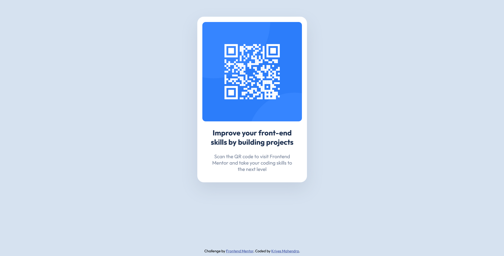
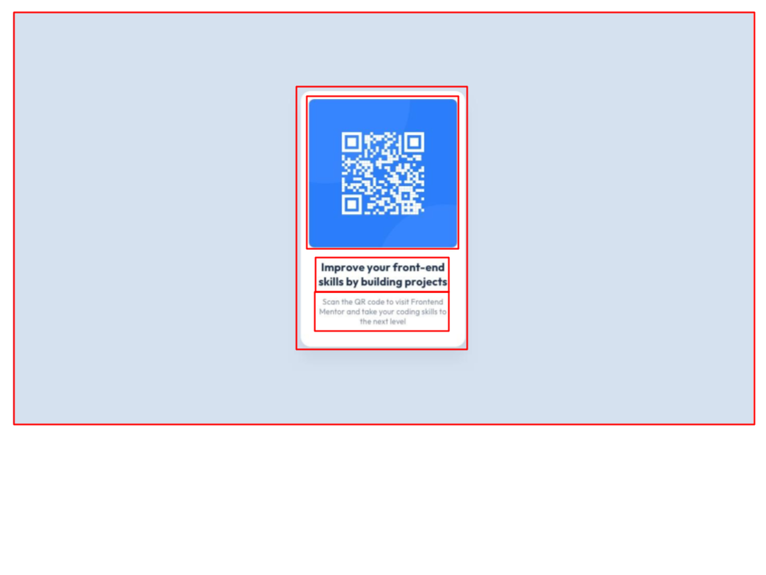

# Frontend Mentor - QR code component solution

This is a solution to the [QR code component challenge on Frontend Mentor](https://www.frontendmentor.io/challenges/qr-code-component-iux_sIO_H). Frontend Mentor challenges help you improve your coding skills by building realistic projects. 

## Table of contents

- [Overview](#overview)
  - [Screenshot](#screenshot)
  - [Links](#links)
- [My process](#my-process)
  - [Built with](#built-with)
  - [What I learned](#what-i-learned)
  - [Continued development](#continued-development)
  - [Useful resources](#useful-resources)
- [Author](#author)


## Overview

A simple design with a QR code which takes you to the frontendmentor website.

### Screenshot



### Links

- Solution URL: https://github.com/Kriyes-M/qr-code-component-main
- Live Site URL: https://kriyes-m.github.io/qr-code-component-main/

## My process
First I compartmentalize the design into the smallest parts I can create in html. If it's straightforward I go straight to writing the html, otherwise I will use an image editting software to draw out the different parts like this:


After writing the html for the basic structure, I style components one after another with CSS.

Lastly I compare with the initial design to look for any discrepancies and fix them.

### Built with

- Semantic HTML5 markup
- CSS custom properties
- Mobile-first workflow

### What I learned

One of the key things I learned during this project is that I can use an 'auto' value for margins to center components.

For example I used auto for the left and right margins on this card to center it:

```css
.card {
  display: flex;
  flex-direction: column;
  width: 330px;
  height: 500px;
  background-color: white;
  border: none;
  border-radius: 20px;
  margin: 50px auto 200px auto;
  box-shadow: 0px 20px 50px 0px hsla(220, 15%, 55%, 0.2);
}
```

### Continued development

Although I have learnt about CSS grid and flexbox, I am unsure when to use them so I will attempt to use them on future projects to see which situations they are viable in.

### Useful resources

- [How to center an image in html](https://blog.hubspot.com/website/center-an-image-in-html) - This article helped me understand the different ways to center an image or other component.

## Author
Kriyes Mahendra
- Frontend Mentor - [@Kriyes-M](https://www.frontendmentor.io/profile/Kriyes-M)
